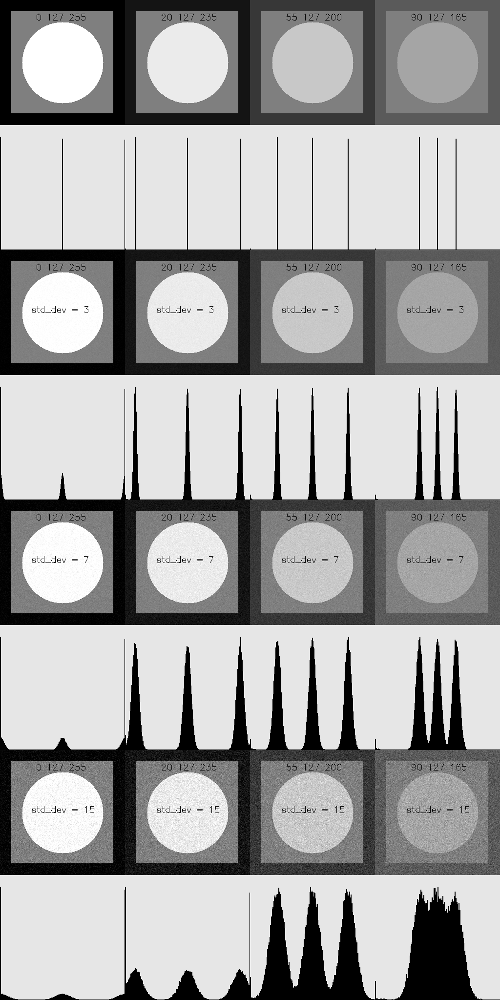

# Отчет по 2 ЛР

В рамках второй лабораторной работы были реализованы необходимые функции для генерации изображений с четырьмя уровнями яркости, построения гистограмм яркости на квадратном растре и добавления аддитивного нормального несмещенного шума.

Были созданы тестовые изображения для 4-х наборов уровней яркости:

1. [0,127,255]
2. [20,127,235]
3. [55,127,200]
4. [90,127,165]

Также были сгенерированы зашумленные изображения и гистограммы, которые размещаются встык ниже тестового изображения. Зашумление было выполнено для трех значений среднеквадратичного отклонения: 3, 7, 15.

Все изображения были склеены в одно цельное изображение, представляющее результат работы выполненных функций.

Вывод:

