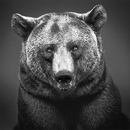
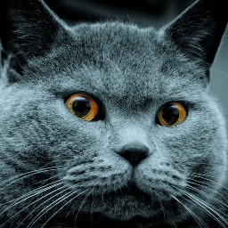
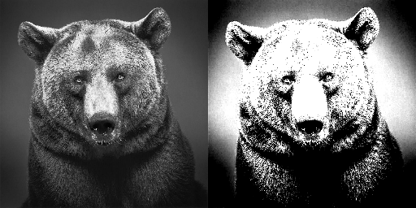
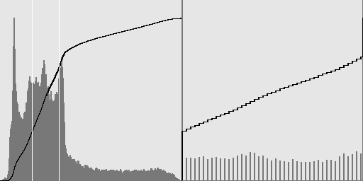
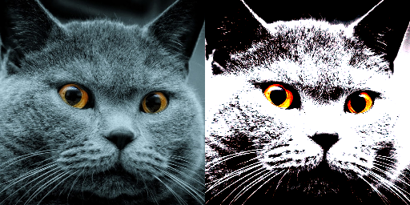
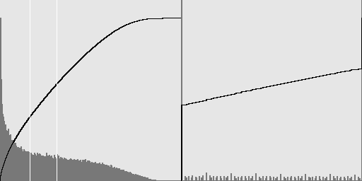
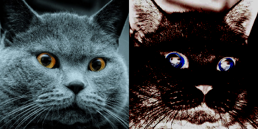
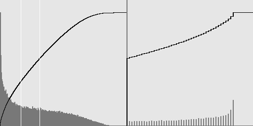

# Отчет по 3 ЛР

### Цель

Научиться созданию и примененнию функций автоконтрастирования черно-белых и цветных изображений по квантилям.

### Ход работы

В рамках второй лабораторной работы были реализовано консольное приложение с функциями для автоконтрастирования черно-белых и цветных изображений по квантилям.

Были взяты тестовые изображения:

Черно-белое:



Цветное:



Для автоконтрастирования цветных изображений поканально требуется контрастировать отдельно три канала BGR, а потом соединять их в одно изображение.

Для автоконтрастирования цветных изображений совместно требуется найти минимальный среди трех каналов Clow и максимальный Chigh. Затем контрастируем три канала BGR уже с этими общеми Clow, Chigh, а потом соединяем их в одно изображение.

### Работа консольного приложения

Для запуска исполняемого приложения, нужно найти исполняемый файл в вашей директории и прописать в консоль:

```.\lab03.exe <Путь изображения для контрастирования> <q0> <q1>```

q0 и q1 - квантили. Дефолтные значения квантилей 0.3 и 0.7 соответственно.

Также можно просто запустить исполняемый файл, подкоректировав параметры в самой программе.

### Вывод

Автоконтрастирование изображений:

Черно-белое при q0 = 0.3 и q1 = 0.7:





Цветное с поканальным автоконтрастированием при q0 = 0.4 и q1 = 0.6:





Цветное с совместным автоконтрастированием при q0 = 0.4 и q1 = 0.6:



