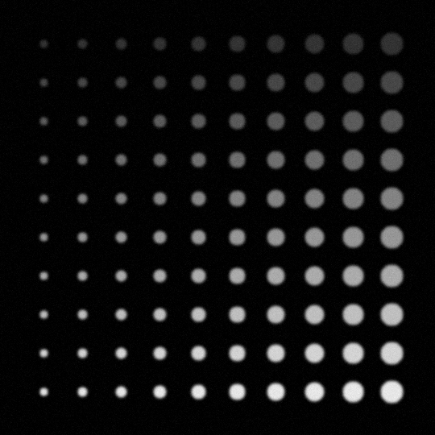
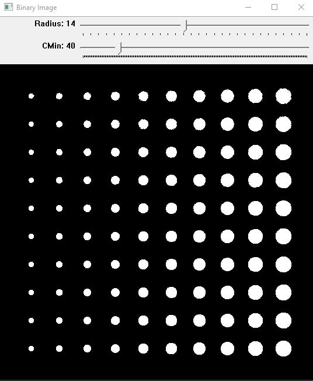
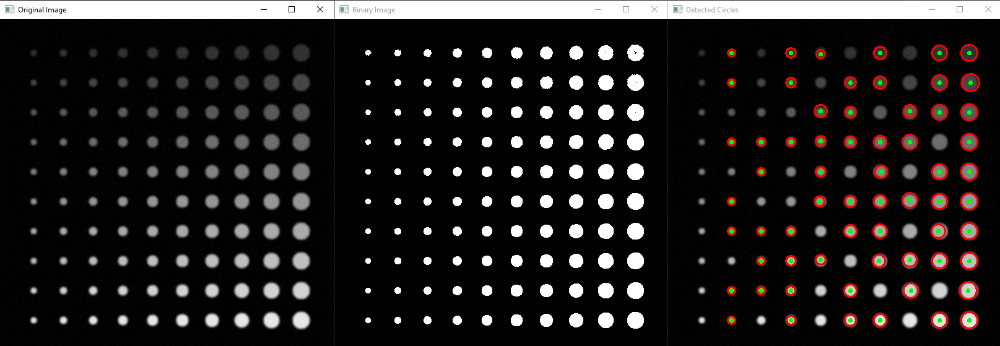
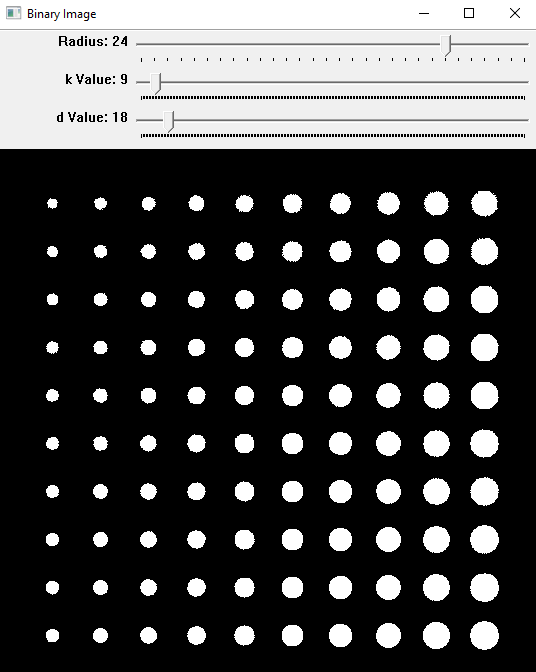
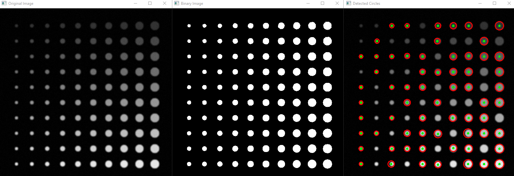

# Отчет по 4 ЛР

### Цель

Изучить и реализовать различные методы бинаризации изображений. Рассмотреть возможные варианты создания GUI для измененния параметров бинаризации, а также реализовать функционал для детектирования объектов изображения с возможностью оценки качества детектирования.

### Ход работы

В ходе выполнения четвертой лабораторной работы была написана программа, которая генерирует тестовое изображение с заданными параметрами и реализует несколько вариантов бинаризации. Также был предусмотрен режим визуальной настройки параметров бинаризации через GUI, реализован функционал для детектирования объектов на изображении и для оценки качества работы алгоритмов.

Тестовое изображение с параметрами генерации countCircles=10, minRadius=5, maxRadius=15, minContrast=50, maxContrast=255, blur=4:



Бинаризация исходного изображения методом Бернсена:



Детектирование при параметрах radius = 14, CMin = 40:



Бинаризация исходного изображения методом Ниблека:



Детектирование при параметрах Radius = 24, k Value = 9, d Value = 18:



### Работа консольного приложения

Для запуска консольного приложения, нужно найти исполняемый файл в вашей директории и прописать в консоль:

```.\lab04.exe <countCircles> <minRadius> <maxRadius> <minContrast> <maxContrast> <blur> <method("bernsen", "niblack", "detection")>```

Также можно просто запустить исполняемый файл, подкоректировав параметры в самой программе.

### Вывод

Как можем заметить, объекты детектируются лучше, при бинаризации методом Ниблека.