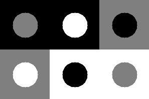
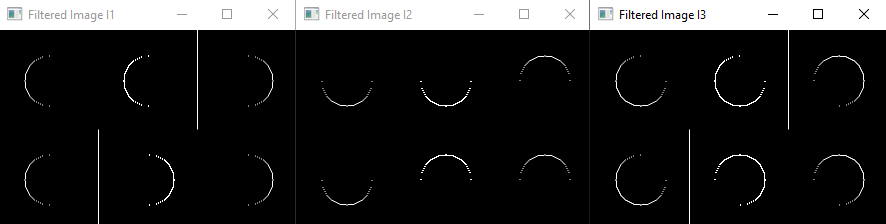
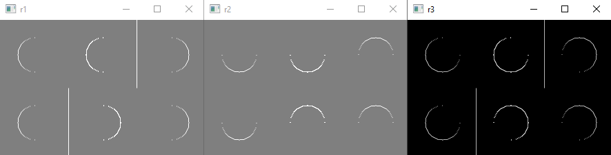
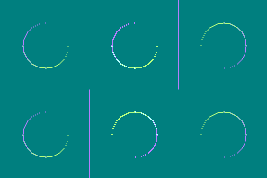

# Отчет по 5 ЛР

### Цель

Изучить работу функцию filter2D() с заданными значениями матрицы ядра.

### Ход работы

В ходе выполнения пятой лабораторной работы была написана программа, которая генерирует тестовое изображение с заданными параметрами яркости и фильтрует его через filter2D() c различными матрицами ядра.

Исходное изображение:

1. Отфильтровать и визуализировать I1 (фильтр вида):

$$
    \begin{pmatrix}
    -1 & 1 \\
    -1 & 1 \\
    \end{pmatrix}
$$ 

2. Отфильтровать и визуализировать I2 (фильтр вида):

$$
    \begin{pmatrix}
    -1 & 1 \\
    -1 & 1 \\
    \end{pmatrix}
$$ 

3. Вычислить и визуализировать среднее геометрическое I3:

$$
    I3 = \sqrt{I1^2 + I2^2}
$$

### Вывод

Результаты работы фильтров:

Каналы для итогового RGB изображения:

Результат:

