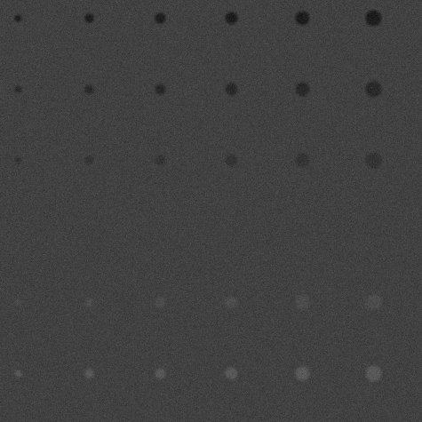

# Отчет по 7 ЛР

### Цель

Изучить и реализовать метод сегментации изображений. Рассмотреть возможные варианты оценки качества сегментации с использованием эталонной разметки и реализовать функционал для этого.

### Ход работы

В ходе выполнения седьмой лабораторной работы была написана программа, которая генерирует тестовое изображение из json с заданными параметрами и производит Edge-Based сегментацию объектов изображения с последующей оценкой метрик. 

Edge-Based сегментация - этот метод основывается на том, что границы объектов в изображениях обычно соответствуют резким изменениям интенсивности, цвета или текстуры.

Тестовые изображения с различными параметрами генерации:

1. size - 200x200, background color = 100, blur = 2.0, noise = 3.0:

2. size - 375x375, background color = 85, blur = 2.0, noise = 3.0:

3. size - 475x475, background color = 65, blur = 2.0, noise = 5.0:

Соответствующие результаты сегментации:

1.
| |  |

2.
| |  |

3.
| |  |

