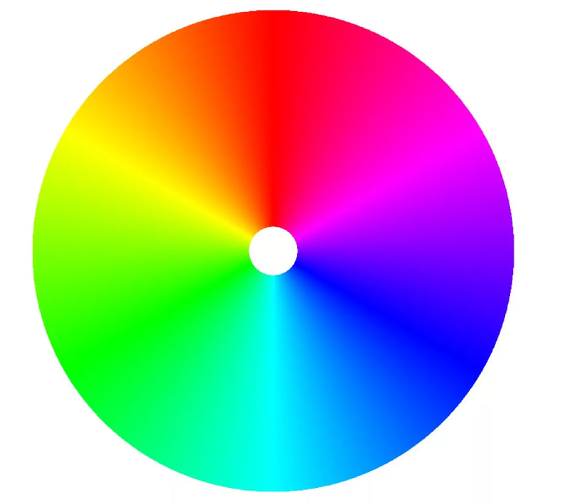
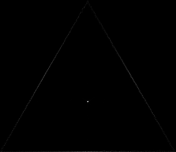

# Отчет по 8 ЛР

### Цель

Изучить плотность цветового распределения и визуализировать это в linRGB.

### Ход работы

В рамках первой лабораторной работы было разработано консольное приложение для визуализации плотности цветового распределения в linRGB.

Есть цветовой куб rgb. Через точку (0.5, 0.5, 0.5) проводится плоскость с нормалью (1, 1, 1). Каждый цвет будет проецироваться на эту плоскость через точку (0, 0, 0).

Исходные изображения:

1.


2.


### Работа консольного приложения

Для запуска исполняемого приложения, нужно найти исполняемый файл в вашей директории и прописать в консоль:

```.\lab08.exe <input> <output> <size>```

input - Путь изображения для визуализации плотности
output - Путь сохранения изображения
size - Размер изображения

Также можно просто запустить исполняемый файл, подкоректировав параметры в самой программе.

### Вывод

Результат:

1.


2.
