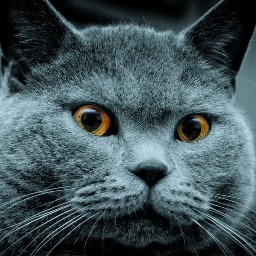
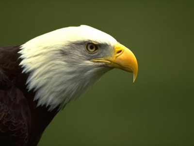
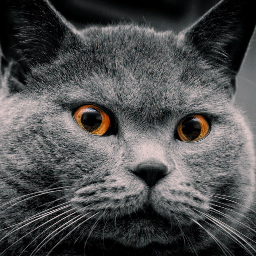
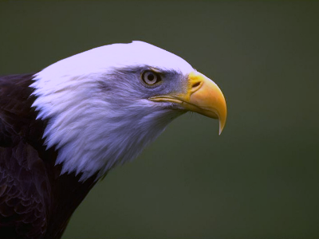

# Отчет по 9 ЛР

### Цель
Изучить и реализовать метод Gray World 

### Ход работы

Исходные изображения:

1.


2.


### Работа консольного приложения

Для запуска исполняемого приложения, нужно найти исполняемый файл в вашей директории и прописать в консоль:

```.\lab09.exe <input> <output>```

input - Путь изображения для автоконтрастирования

output - Путь сохранения изображения

size - Размер изображения

Также можно просто запустить исполняемый файл, подкоректировав параметры в самой программе.

### Вывод

Результат

1.


2.
